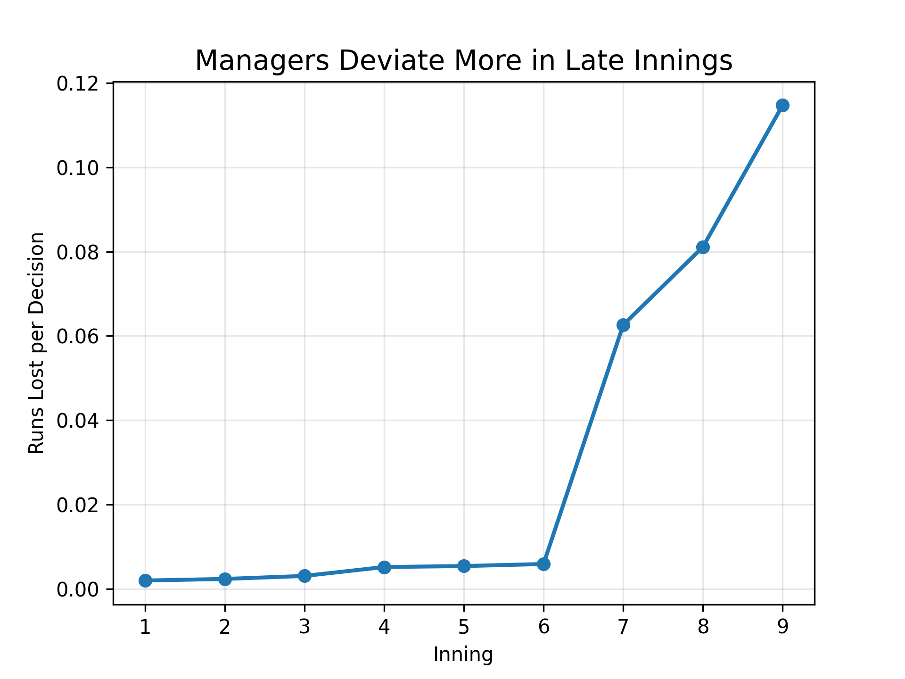
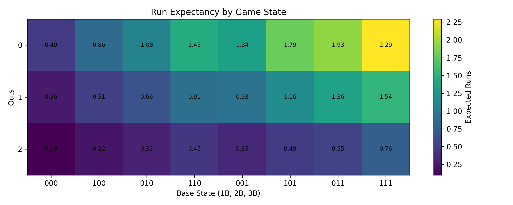
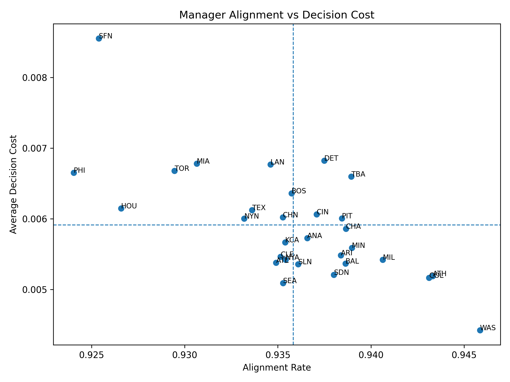

# Starting Pitcher Stay vs. Pull Decision Framework

This project uses Retrosheet event-level MLB data from the 2022–2025 seasons to evaluate when managers should remove a starting pitcher from a game.

The analysis builds a run expectancy framework, engineers pitcher fatigue and game-context features, and compares historical managerial decisions against model-based recommendations. The project combines baseball domain knowledge with predictive modeling and decision analysis to quantify the expected run cost of pitching decisions throughout a game.

The analysis finds that managers tend to leave starters in games longer than the model recommends, particularly in late-inning and third-time-through-the-order situations.

---

## Project Goals

- Build a run expectancy model using MLB play-by-play data
- Engineer pitcher fatigue and workload features
- Estimate the expected cost of leaving a starter in the game
- Compare historical managerial decisions against model-based recommendations
- Quantify team and manager-level decision efficiency

---

## Data

This project uses event-level Major League Baseball play-by-play data from the 2022–2025 seasons obtained from Retrosheet and processed using Chadwick Tools.

### Data Sources

- Retrosheet event files: https://www.retrosheet.org/
- Chadwick Tools: https://github.com/chadwickbureau/chadwick

Retrosheet event files contain detailed pitch-by-pitch and plate appearance-level game information, including:
- inning and game state
- outs and baserunner configuration
- batter and pitcher identifiers
- scoring events
- substitutions and pitching changes
- play outcomes

The raw event files were converted into CSV format using Chadwick Tools before being combined into a unified event-level dataset for analysis.

### Data Scope

The analysis focuses on MLB regular season games from 2022–2025, corresponding to the modern universal designated hitter era. Using multiple seasons allowed the model to evaluate managerial decision-making across a large sample of pitching appearances and game situations.

### Feature Engineering

Several baseball-specific features were engineered from the raw play-by-play data, including:
- run expectancy by base-out state
- batters faced
- times through the order
- pitch count buckets
- inning context
- score differential buckets
- baserunner state indicators
- recent pitcher performance
- starter versus reliever identification

These features were used to estimate the expected impact of leaving a starting pitcher in the game versus making a pitching change.

### Data Availability

Raw Retrosheet event-level datasets are not included in this repository because of file size limitations. The repository instead focuses on the analytical framework, feature engineering pipeline, modeling approach, and project outputs.

Users interested in reproducing the full analysis can obtain the raw data directly from Retrosheet and process the files using Chadwick Tools.

---

## Project Pipeline

The project is organized as a modular Python pipeline, with each script handling a specific stage of the analysis.

```text
src/
├── load_combine_files.py       # Loads yearly Retrosheet CSV files and combines them into one dataset
├── run_expectancy.py           # Builds run expectancy features using base-out states
├── pitcher_features.py         # Engineers pitcher workload and fatigue-related features
├── modeling.py                 # Trains the expected runs model
├── decision_framework.py       # Compares model-based stay/pull recommendations against actual decisions
├── manager_performance.py      # Summarizes manager and team-level alignment with the model
└── visualizations.py           # Generates charts and tables used in the final analysis
```

### Pipeline Flow

```text
Raw Retrosheet event files
        ↓
load_combine_files.py
        ↓
run_expectancy.py
        ↓
pitcher_features.py
        ↓
modeling.py
        ↓
decision_framework.py
        ↓
manager_performance.py
        ↓
visualizations.py
        ↓
Final charts, tables, and presentation outputs
```

This structure separates data loading, feature engineering, modeling, decision evaluation, and visualization into distinct scripts, making the project easier to understand, maintain, and extend.

---

## Modeling Approach

The project uses a linear regression framework to estimate expected future runs allowed from a given game state.

The model incorporates:
- base-out run expectancy
- times through the order effects
- pitch count fatigue
- recent pitcher performance
- inning and score context
- bullpen cost assumptions
- reliever quality adjustments

The decision framework then compares two scenarios:
1. Leave the starting pitcher in the game
2. Replace the starter with a hypothetical fresh reliever

The model estimates the expected run impact of each option and evaluates whether historical managerial decisions aligned with the lower expected-cost choice.

---

## Results

Key findings from the analysis include:

- The model identified significantly larger decision costs during late innings and third-time-through-the-order situations.
- Managers generally left starters in games more often than the model recommended.
- Team-level alignment with the model varied substantially, suggesting organizational differences in pitching management philosophy.
- The framework quantified the expected run impact of pitching decisions rather than evaluating decisions solely based on game outcomes.

---

## Key Visuals

### Decision Value by Inning



### Run Expectancy Heatmap



### Manager Alignment vs Decision Cost



---

## Repository Structure

```text
src/                Python analysis scripts
outputs/figures/    Generated visualizations
report/             Final presentation slides
```

---

## How to Run

Because the raw Retrosheet data is not included in this repository, users must first download and process the event files locally.

Once the data is available locally, run the scripts in the following order:

```bash
python src/load_combine_files.py
python src/run_expectancy.py
python src/pitcher_features.py
python src/modeling.py
python src/decision_framework.py
python src/manager_performance.py
python src/visualizations.py
```

---

## Tools Used

- Python
- pandas
- numpy
- matplotlib
- scikit-learn

---

## Final Presentation

[View the final presentation slides](report/starting_pitcher_final_presentation.pdf)